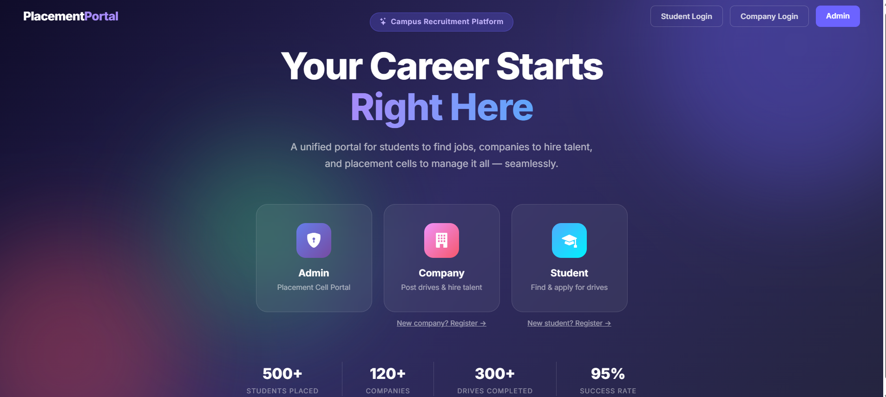
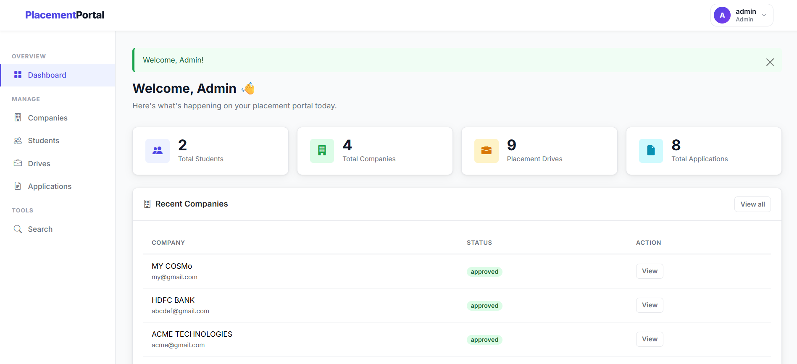
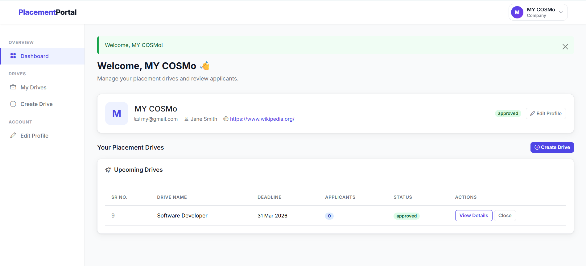
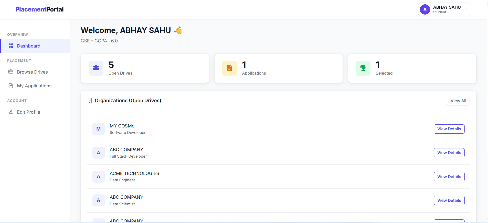
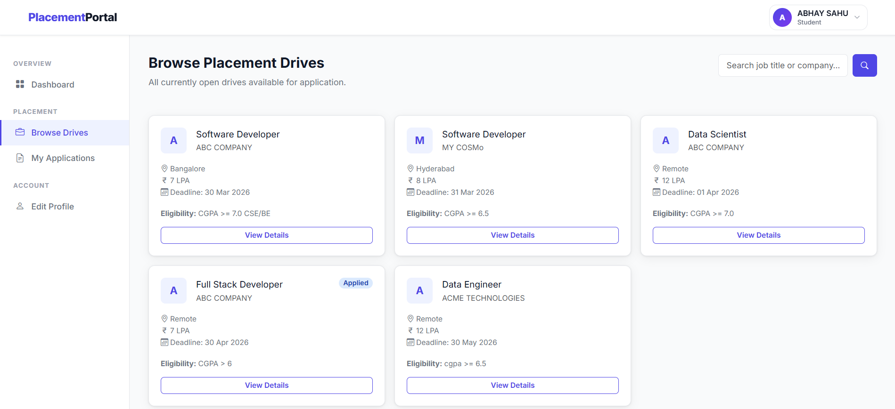
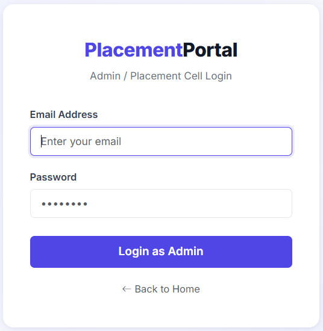

# 🎓 Placement Portal



A full-stack **Campus Placement Management System** built with Python (Flask) that connects Students, Companies, and the Institute Placement Cell on a single platform.

### Admin Dashboard



### Company Dashboard



### Student Dashboard



### Browse Placement Drives



### Login Page



---

## 🚀 Features

### 🛡️ Admin (Placement Cell)

- Dashboard with live stats — total students, companies, drives, applications
- Approve or reject company registrations
- Approve or reject placement drives
- View and manage all students, companies, and drives
- Edit, deactivate, or blacklist student and company accounts
- Search students and companies by name or ID

### 🏢 Company

- Register and create a company profile (pending admin approval)
- Login only after admin approves the registration
- Create, edit, close, and delete placement drives
- View all student applications per drive
- Update application status — Shortlisted / Selected / Rejected

### 🎓 Student

- Self-register, login, and update profile
- Browse all approved placement drives
- Apply for drives (duplicate applications prevented)
- Track application status in real time
- View full placement history
- Upload PDF resume (max 5 MB)

---

## 🛠️ Tech Stack

| Layer      | Technology                               |
| ---------- | ---------------------------------------- |
| Backend    | Python 3, Flask 3.0.3                    |
| Database   | SQLite + SQLAlchemy 3.1.1                |
| Frontend   | HTML5, CSS3, Bootstrap 5.3               |
| Templating | Jinja2                                   |
| Icons      | Bootstrap Icons 1.11.3                   |
| Security   | Werkzeug 3.0.3 (bcrypt password hashing) |

---

## 📁 Project Structure

```
placement_portal/
├── app.py                        # Entry point — creates app, seeds admin, runs server
├── requirements.txt
├── backend/
│   ├── __init__.py
│   ├── models.py                 # 5 database models (Admin, Company, Student, Drive, Application)
│   └── routes.py                 # All routes organized in 5 sections
├── static/
│   ├── css/
│   │   └── styles.css            # All CSS in one file
│   └── uploads/
│       └── resumes/              # Student resume PDFs stored here
└── templates/
    ├── base.html                 # Master HTML shell
    ├── layout_dashboard.html     # Shared dashboard layout (navbar + sidebar)
    ├── auth/
    │   ├── home.html             # Landing page
    │   ├── login.html            # Shared login for all 3 roles
    │   └── register.html         # Shared register for student + company
    ├── admin/                    # 10 admin templates
    ├── company/                  # 7 company templates
    └── student/                  # 6 student templates
```

---

## 🗄️ Database Schema

```
Admin          Company           Student
  │               │                 │
  │         ┌─────┘                 │
  │         │                       │
  │    PlacementDrive ──────── Application
  │         │                       │
  └─────────┘                       └── (student_id, drive_id) UNIQUE
```

### Tables

| Table                    | Key Fields                                                 | Status Values                               |
| ------------------------ | ---------------------------------------------------------- | ------------------------------------------- |
| **Admin**          | id, username, email, password_hash                         | —                                          |
| **Company**        | id, company_name, email, hr_contact, approval_status       | pending / approved / rejected / blacklisted |
| **Student**        | id, full_name, email, branch, year, cgpa, is_active        | active / inactive                           |
| **PlacementDrive** | id, company_id, job_title, location, package_lpa, deadline | pending / approved / closed / rejected      |
| **Application**    | id, student_id, drive_id, applied_at, status               | applied / shortlisted / selected / rejected |

---

## ⚙️ Installation & Setup

### 1. Clone the repository

```bash
git clone https://github.com/YOUR_USERNAME/placement-portal.git
cd placement-portal
```

### 2. Create a virtual environment

```bash
# Windows
python -m venv .myenv
.myenv\Scripts\activate

# Mac / Linux
python3 -m venv .myenv
source .myenv/bin/activate
```

### 3. Install dependencies

```bash
pip install -r requirements.txt
```

### 4. Run the application

```bash
python app.py
```

### 5. Open in browser

```
http://127.0.0.1:5000
```

---

## 🔐 Default Admin Credentials

The admin account is **automatically created** on first run. No manual setup needed.

```
Email    : admin@placement.com
Password : admin123
```

> ⚠️ Change the password after first login in a production environment.

---

## 🔗 API Routes

### Auth

| Method   | URL                                   | Description   |
| -------- | ------------------------------------- | ------------- |
| GET      | `/`                                 | Home page     |
| GET/POST | `/login?role=admin\|company\|student` | Unified login |
| GET/POST | `/register?role=company\|student`    | Register      |
| GET      | `/logout`                           | Logout        |

### Admin

| Method | URL                                 | Description       |
| ------ | ----------------------------------- | ----------------- |
| GET    | `/admin/dashboard`                | Stats dashboard   |
| GET    | `/admin/companies`                | All companies     |
| GET    | `/admin/companies/<id>/approve`   | Approve company   |
| GET    | `/admin/companies/<id>/reject`    | Reject company    |
| GET    | `/admin/companies/<id>/blacklist` | Blacklist company |
| GET    | `/admin/students`                 | All students      |
| GET    | `/admin/drives`                   | All drives        |
| GET    | `/admin/drives/<id>/approve`      | Approve drive     |
| GET    | `/admin/drives/<id>/reject`       | Reject drive      |
| GET    | `/admin/search`                   | Search            |

### Company

| Method   | URL                                   | Description       |
| -------- | ------------------------------------- | ----------------- |
| GET      | `/company/dashboard`                | Dashboard         |
| GET/POST | `/company/drives/create`            | Create drive      |
| GET/POST | `/company/drives/<id>/edit`         | Edit drive        |
| GET      | `/company/drives/<id>/close`        | Close drive       |
| GET      | `/company/drives/<id>/delete`       | Delete drive      |
| GET/POST | `/company/drives/<id>/applications` | Manage applicants |
| GET/POST | `/company/profile/edit`             | Edit profile      |

### Student

| Method   | URL                            | Description           |
| -------- | ------------------------------ | --------------------- |
| GET      | `/student/dashboard`         | Dashboard             |
| GET      | `/student/drives`            | Browse drives         |
| GET      | `/student/drives/<id>`       | Drive detail          |
| POST     | `/student/drives/<id>/apply` | Apply for drive       |
| GET      | `/student/applications`      | Application history   |
| GET/POST | `/student/profile/edit`      | Edit profile + resume |

---

## 🔒 Security

| Layer                  | Implementation                                               |
| ---------------------- | ------------------------------------------------------------ |
| Password Hashing       | Werkzeug bcrypt — passwords never stored as plain text      |
| Role-Based Access      | `@login_required(role)` decorator on every dashboard route |
| Session Isolation      | `session['role']` checked on every protected request       |
| SQL Injection          | SQLAlchemy ORM — zero raw SQL queries                       |
| Ownership Checks       | Company can only edit/delete its own drives                  |
| File Upload Safety     | PDF only,`secure_filename()`, 5 MB limit                   |
| Duplicate Applications | `UniqueConstraint(student_id, drive_id)` at DB level       |
| Account Control        | Admin can deactivate students and blacklist companies        |

---

## 📋 Requirements

```
Flask==3.0.3
Flask-SQLAlchemy==3.1.1
Werkzeug==3.0.3
```

## 👨‍💻 Author

**Abhay Sahu**

- IIT Madras — BS in Data Science and Applications
- Email: abhaysahu7355@gmail.com

---

## 📄 License

This project was built for academic purposes as part of the IIT Madras BS program.
